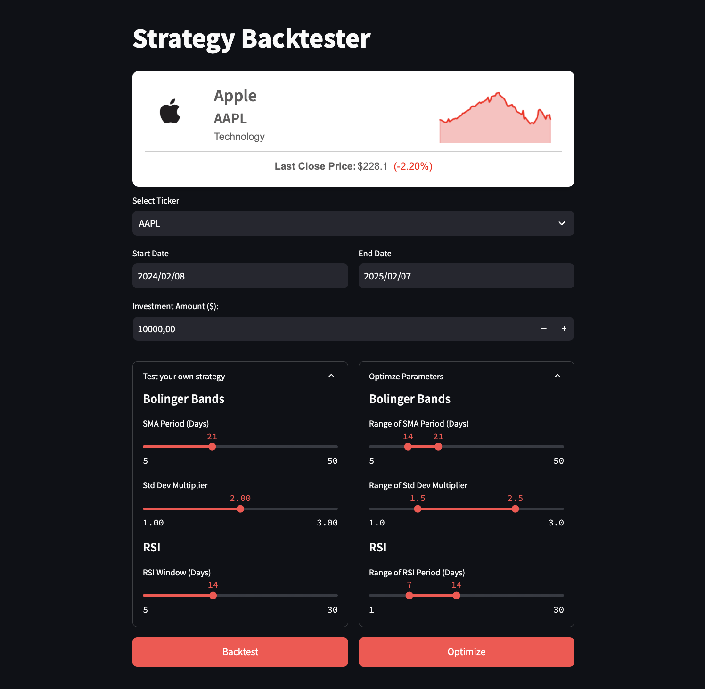
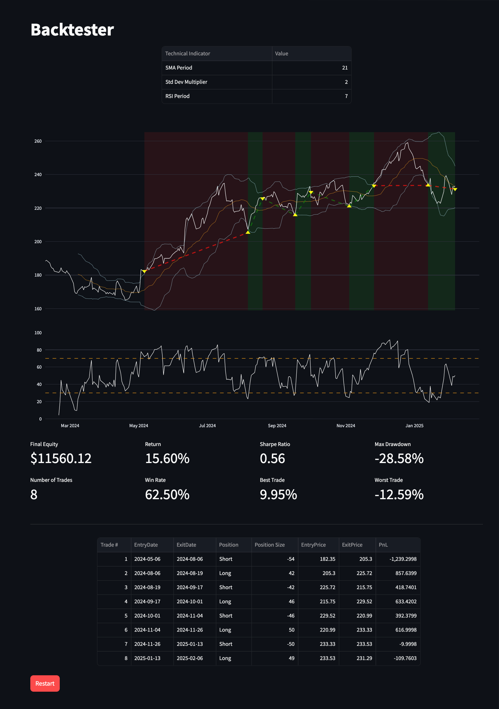
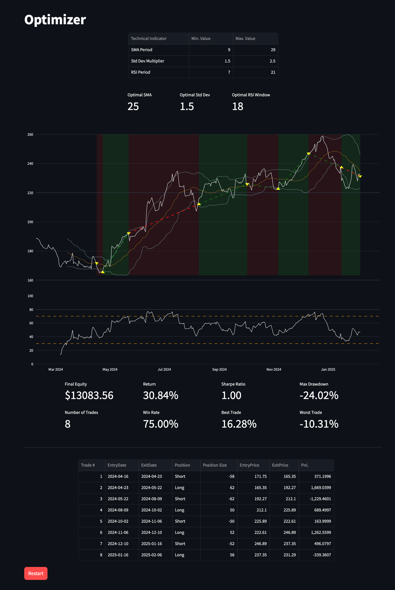

# **Strategy Backtester & Parameter Optimizer**

A [**Streamlit**](https://algotest.streamlit.app/) web application that enables users to backtest trading strategies and optimize their parameters interactively. The app provides insights into strategy performance, risk metrics, and parameter tuning to enhance trading decisions.

## **1. Strategy Input Interface:**
- **Asset Selection**: Users can specify the assets for backtesting.
- **Time Period Selection**: Users can select a historical time range for backtesting.
- **Parameter Customization**: The app allows users to adjust key parameters such as moving average lengths, rsi period.

## **2. Backtesting & Performance Metrics:**
The app runs backtests on the selected strategy and calculates key performance metrics, including:
- **Final Equity**: The total value of the portfolio at the end of the backtesting period.
- **Return**: The cumulative return generated by the strategy over the backtested period.
- **Sharpe Ratio**: A measure of risk-adjusted return, considering the risk-free rate.
- **Maximum Drawdown (MDD)**: The largest peak-to-trough decline in portfolio value, helping assess the risk of substantial losses.
- **Number of Trades**: The total number of trades executed during the backtest.
- **Win Ratio**: The percentage of profitable trades versus total trades.
- **Best Trade**: The highest profit made in a single trade.
- **Worst Trade**: The largest loss incurred in a single trade.

## **3. Parameter Optimization:**
The app allows users to optimize strategy parameters that maximizes the sharpe ratio using a grid search approach.

Users can visualize the performance impact of different parameter settings through interactive heatmaps and performance charts.

## **4. How to Use the App:**
To start using the Strategy Backtester & Parameter Optimizer, visit the [Streamlit app](https://algotest.streamlit.app/) and follow these steps:
1. Select or define a trading strategy.
2. Configure backtesting parameters such as time range, assets, and trading rules.
3. Run the backtest and analyze performance metrics.
4. Optionally, optimize strategy parameters for improved results.
